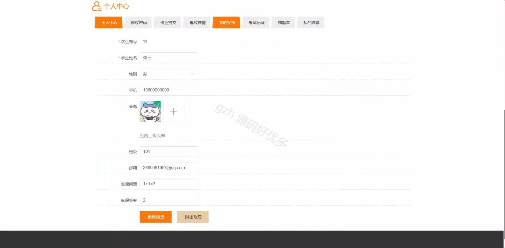

# springbootA400D
springbootA400D校园教学资源共享与交流平台
## 查看主页获取源码

### 一、关键词

课程资源、作业信息、交流论坛

 

### 二、作品包含

源码+数据库+设计文档万字+全套环境和工具资源+部署教程

 

### 三、项目技术

前端技术：Html、Css、Js、Vue2.0、Element-ui 
后端技术：Java、SpringBoot2.0、MyBatis

  

 

### 四、运行环境（以下版本亲测，其他版本未知，请自测）

开发工具：IDEA/eclipse  + VSCODE

数据库：MySQL5.7（最低要5.7版本）

数据库管理工具：Navicat10以上版本

环境配置软件： JDK1.8 + Maven3.6.3

前端Nodejs：14

浏览器：谷歌浏览器

 

### 五、项目介绍

项目编号：springbootA400D

校园教学资源共享与交流平台通过整合、分享各类教学资源并搭建互动渠道，助力师生便捷获取资源、促进知识交流与教学协同，提升教育资源利用率与教学质量。

角色：管理员、用户、教师

用户功能：首页、课程资源、作业信息、交流论坛、在线考试、通知公告、解答疑问、个人中心、修改密码、作业提交、批改详情、我的发布、考试记录、错题本、我的收藏。

教师功能：主页、课程资源、作业信息、作业提交、批改详情、试题库管理、试题管理、在线考试管理、考试记录、个人中心。

管理员功能：主页、学生、教师、课程资源、课程分类、作业信息、作业分类、作业提交、批改详情、解答疑问、在线考试管理、举报记录、论坛分类、试题库管理。

 

### 六、运行截图

